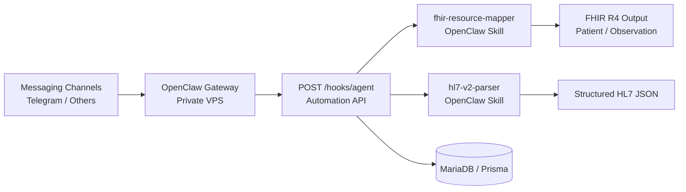

# OpenClaw Clinical Interop POC

A portfolio-grade POC for secure, self-hosted agentic workflows with an OpenClaw-first integration model and healthcare interoperability demos.

## Why This Project
- Demonstrates practical OpenClaw integration for real-world messaging workflows.
- Shows healthcare interoperability patterns using HL7 v2 parsing and FHIR resource mapping.
- Uses security-first API boundaries (zod validation, correlation IDs, safe webhook intake).
- Designed as a client-facing POC for consulting/freelance delivery discussions.

## Architecture (High Level)

## Infrastructure Topology (Dual VPS)
- OpenClaw Gateway host (private-facing runtime for channel integrations).
- SMART on FHIR host (FHIR ecosystem integration surface).
- API + skills are built to connect to both through controlled, validated boundaries.
- Public repository keeps all deployment identifiers anonymized.

Publish-safe placeholders used in this repo:
- `OPENCLAW_GATEWAY_URL=https://openclaw.example.com`
- `FHIR_BASE_URL=https://fhir.example.com`
- `TELEGRAM_CHAT_ID=<your_chat_id>`

## Tech Stack
- Node.js + TypeScript (strict)
- Express
- zod
- Prisma
- MariaDB (Docker)
- OpenClaw Gateway integration patterns

## Implemented Capabilities
- API routes:
	- `GET /health`
	- `GET /api/v1/automations`
	- `POST /hooks/agent` (token-aware, validated, correlation-enabled)
- OpenClaw-aligned skills:
	- `fhir-resource-mapper`
	- `hl7-v2-parser`
- Input validation and safe error handling for external payloads.

## Security and Privacy Posture
- No secrets or private infrastructure values in repository content.
- Public docs and examples use anonymized placeholders.
- Internal runbooks and deployment notes stay local-only.

## Demo Scenarios
- HL7 v2 message intake -> parser skill -> normalized JSON for workflow routing.
- Synthetic clinical payload -> FHIR mapper skill -> standards-aligned Patient/Observation output.
- External trigger -> OpenClaw Gateway -> validated webhook intake -> skill orchestration pipeline.

## Repository Structure
- `automation-api/` core REST API and middleware
- `agents/openclaw/` OpenClaw skill package and runtimes
- `db/` schema and migration artifacts
- `docs/public/` user-facing documentation

## Next Technical Milestones
- Hook-to-skill execution dispatch and workflow orchestration.
- Execution audit persistence and traceable run history.
- Expanded integration tests for routing and failure paths.

## Author
Hisham Alrashdan

## License
MIT License
